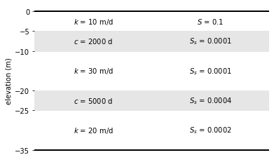
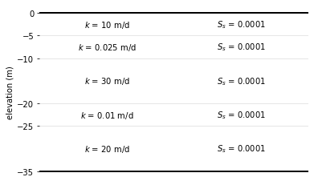

Starting a model
================

There are two ways to start a model:

1. :class:`~ttim.model.ModelMaq`, which is model consisting of a regular sequence of aquifer - leaky layer - aquifer - leaky layer, aquifer, etc.
   The top of the system can be either an aquifer or a leaky layer. The head is computed in all aquifer layers only.

.. code-block:: python

    ml = ModelMaq(
        kaq=[10, 30, 20],
        z=[0, -5, -10, -20, -25, -35],
        c=[2000, 5000],
        Saq=[0.1, 1e-4, 2e-4],
        Sll=[1e-4, 4e-4],
        phreatictop=True,
        tmin=0.01, tmax=10
    )

    A `ModelMaq` example with three aquifers and two leaky layers. Top layer is phreatic.
    Minimum time is 0.01 day, maximum time is 10 days.

2. :class:`~ttim.model.Model3D`, which is a model consisting of a stack of aquifer layers. The resistance between the aquifer layers is computed
   as the resistance from the middle of one layer to the middle of the next layer. Vertical anisotropy can be specified. The system
   may be bounded on top by a leaky layer.

.. code-block:: python

    ml = ttim.Model3D(
        kaq=[10, 0.025, 30, 0.01, 20],
        z=[0, -5, -10, -20, -25, -35],
        kzoverkh=0.1,
        Saq=1e-4,
        tmin=0.01,
        tmax=10
    )

    A `Model3D` example consisting of five layers all treated as aquifers and a vertical anisotropy of 0.1
    Minimum time is 0.01 day, maximum time is 10 days.